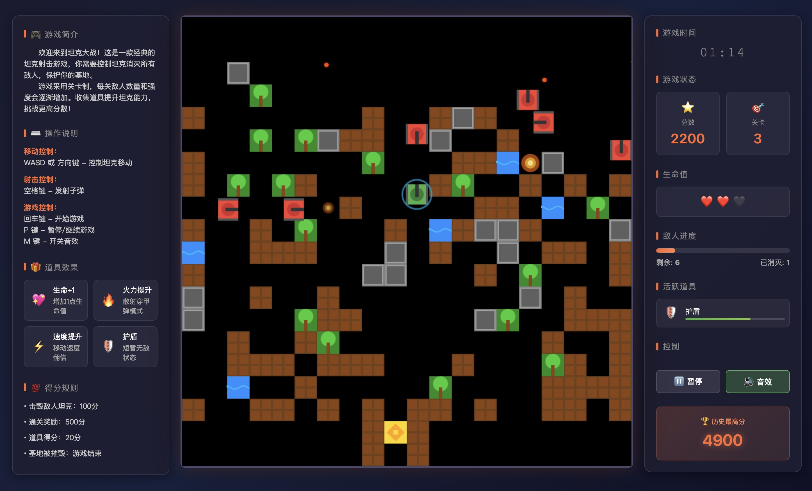

# 🎮 坦克大战 - Tank Battle

一个基于 HTML5 Canvas 和原生 JavaScript 开发的经典坦克游戏克隆，致敬任天堂的《坦克大战》（Battle City）。



## ✨ 功能特性

### 桌面应用特性
- 🖥️ 原生桌面应用体验，支持 Windows、macOS、Linux 三大平台
- 🚀 启动自动最大化窗口，沉浸式游戏体验
- 🎮 原生菜单栏，支持游戏控制、视图调整、帮助等功能
- ⌨️ 系统级快捷键支持（重启、退出、全屏、缩放、开发者工具等）
- 🖼️ 支持窗口化/全屏切换（F11 快捷键）
- 💾 独立运行，无需浏览器和网络环境

### 核心玩法
- **玩家坦克** - 使用 WASD 或方向键控制移动，空格键射击
- **AI 敌方坦克** - 自动移动和射击，难度随关卡递增
- **基地保护** - 保护你的金色基地不被敌人摧毁
- **关卡系统** - 通关后自动进入下一关，敌人越来越强
- **键盘快捷键** - 支持回车键开始游戏、P键暂停/继续、M键开关音效
- **对称界面** - 左右两侧边栏，左侧显示游戏简介和玩法，右侧显示游戏状态

### 地图元素
- **🧱 砖墙** - 可被子弹破坏，提供战术掩护
- **🔩 钢墙** - 不可破坏的坚固障碍物（增强子弹可以破坏）
- **💧 水域** - 坦克无法通过的水域
- **🌲 树林** - 可以隐藏坦克的树林
- **🏠 基地** - 需要保护的核心目标

### 游戏系统
- **分数系统** - 消灭敌人获得分数，通关获得奖励
- **生命系统** - 玩家有 3 条生命
- **爆炸效果** - 炫酷的爆炸动画
- **游戏状态** - 开始界面、游戏界面、结束界面
- **音频系统** - 完整的音效系统，支持开关控制
- **道具系统** - 多种道具增强游戏可玩性
- **界面配置** - 可通过配置界面调整游戏参数
- **侧边栏显示** - 游戏时间、分数、关卡、生命值、敌人进度、活跃道具等

### 道具系统
- **⚡ 速度提升** - 移动速度增加 50%，持续 10 秒
- **🔥 火力提升** - 增加射击频率、子弹速度、伤害，支持穿透钢墙，持续 10 秒
- **🛡️ 护盾** - 提供无敌效果，持续 10 秒
- **❤️ 生命** - 增加 1 条生命
- **💣 炸弹** - 消灭所有敌人
- **❄️ 冻结** - 冻结所有敌人 5 秒

## 🎯 操作说明

### 基本操作
| 按键 | 功能 |
|------|------|
| W / ↑ | 向上移动 |
| S / ↓ | 向下移动 |
| A / ← | 向左移动 |
| D / → | 向右移动 |
| 空格键 | 发射子弹 |

### 游戏控制
| 按键 | 功能 |
|------|------|
| 回车键 | 开始游戏/重新开始（在开始界面或游戏结束界面） |
| P 键 | 暂停/继续游戏 |
| M 键 | 开关游戏音效（开启/关闭） |
| 音效按钮 | 开关游戏音效（开启/关闭） |

### 配置界面
点击"配置"按钮可以打开游戏参数配置界面：
- **玩家配置**：调整移动速度、射击冷却时间、初始生命值
- **敌人配置**：调整基础速度、速度增加率、初始数量、数量增加率、最大数量
- **道具配置**：调整道具生成间隔、效果持续时间、道具生命周期
- **地图配置**：调整地图元素数量（砖墙、钢墙、水、森林）
- **音效配置**：调整音效开关和音量

所有配置参数支持实时预览和保存。

## 🚀 快速开始

### 方法一：直接打开
1. 下载或克隆这个项目
2. 用浏览器打开 `index.html` 文件
3. 点击"开始游戏"按钮

### 方法二：本地服务器（推荐）
使用 npm 启动服务器（需要先安装 serve）：

```bash
# 安装 serve（只需安装一次）
npm install -g serve

# 启动服务器
npm run start
```

或者使用 Python 启动服务器：

```bash
# Python 3
python3 -m http.server 8000

# Python 2
python -m SimpleHTTPServer 8000
```

然后在浏览器访问 `http://localhost:8000`

### 方法三：桌面应用（推荐）
支持打包为 Windows、macOS、Linux 三个平台的独立桌面应用，无需浏览器即可运行：

```bash
# 安装所有依赖（首次运行需要）
npm install

# 开发模式运行桌面版
npm run electron:dev

# 打包为当前平台的安装包
npm run electron:build

# 打包特定平台
npm run electron:build:mac   # macOS平台
npm run electron:build:win   # Windows平台
npm run electron:build:linux # Linux平台

# 打包所有平台安装包
npm run electron:build:all
```

## 📁 项目结构

```
tank-game/
├── index.html            # 游戏入口页面（包含左右边栏界面）
├── game.js              # 游戏逻辑代码（包含事件监听和键盘快捷键）
├── package.json         # 项目配置文件
├── electron/            # Electron 桌面应用代码
│   ├── main/
│   │   └── index.js     # 主进程代码
│   └── preload/
│       └── index.js     # 预加载脚本
├── electron-builder.yml # Electron 打包配置
├── test-audio.html      # 音频系统测试页面
├── test-powerups.html   # 道具系统测试页面
└── README.md            # 说明文档
```

## 🎨 技术栈

- **HTML5 Canvas** - 游戏渲染
- **原生 JavaScript** - 游戏逻辑（ES6+）
- **CSS3** - 界面样式
- **Web Audio API** - 音频系统，实时生成音效
- **Web Storage API** - 游戏进度和设置存储（待实现）
- **Electron** - 跨平台桌面应用打包
- **electron-builder** - 安装包构建工具

## 🕹️ 游戏机制

### 碰撞检测
- 坦克 vs 墙壁
- 子弹 vs 坦克
- 子弹 vs 墙壁
- 坦克 vs 坦克
- 玩家 vs 道具

### 道具系统

#### 生成机制
- 道具随机不定时地出现，每 5-15 秒生成一个
- 道具在地图上空位置生成
- 道具会闪烁，有时间限制（3-5 秒）
- 被玩家拾取后会消失
- 每关最多同时存在 3-5 个道具

#### 效果持续时间
- 大部分道具效果持续 10 秒
- 炸弹和生命道具立即生效
- 冻结道具持续 5 秒

#### 视觉效果
- 道具闪烁显示，不同类型有不同颜色
- 护盾有发光效果
- 子弹有不同的视觉效果（增强子弹更大更亮）

### 音频系统

#### 音效类型
- **射击音效** - 玩家和敌人有不同的频率（800Hz/600Hz）
- **爆炸音效** - 支持小爆炸（600Hz）和大爆炸（400Hz）
- **移动音效** - 循环播放的方形波（100Hz/80Hz）
- **关卡完成音效** - 上升的正弦波音阶（523→659→784→1047Hz）
- **游戏结束音效** - 下降的锯齿波（300Hz→100Hz）

#### 音频特性
- **实时生成** - 使用 Web Audio API 实时合成音效，无需外部文件
- **错误处理** - 所有音频函数都有 try-catch 错误处理
- **资源管理** - 音频资源在播放结束后正确清理
- **音量控制** - 所有音效都有合适的音量设置
- **淡出效果** - 停止时使用淡出效果，避免突然中断

#### 控制方法
- 点击界面上的"音效"按钮可以开关所有音效
- 音效开关状态会实时更新按钮显示和颜色

### AI 行为
- 敌人随机改变移动方向
- 敌人自动射击
- 敌人数量和速度随关卡增加

### 关卡设计
- 每关地图随机生成
- 关卡越高，敌人越强
- 砖墙、钢墙等元素数量递增

## 🔧 自定义修改

### 修改游戏速度
在 `game.js` 中找到：
```javascript
speed: 2,  // 玩家速度
speed: 1 + gameState.level * 0.2,  // 敌人速度
```

### 修改子弹速度
```javascript
speed: tank.isPlayer ? 5 : 4,  // 子弹速度
```

### 修改地图大小
```javascript
const TILE_SIZE = 32;  // 瓦片大小
const GRID_SIZE = 20;  // 网格大小
```

### 修改音频系统

#### 修改音效音量
在 `game.js` 中找到音频函数并修改 `gain` 相关设置：
```javascript
// 射击音效
gainNode.gain.setValueAtTime(0.3, audioCtx.currentTime);

// 爆炸音效（大/小）
gainNode.gain.setValueAtTime(size === 'large' ? 0.5 : 0.3, audioCtx.currentTime);

// 移动音效
movementGain.gain.setValueAtTime(0.1, audioCtx.currentTime);

// 关卡完成/游戏结束
gainNode.gain.setValueAtTime(0.3, audioCtx.currentTime);
```

#### 修改音效频率
在 `game.js` 中找到音频函数并修改 `frequency` 相关设置：
```javascript
// 射击音效（玩家/敌人）
oscillator.frequency.value = isPlayer ? 800 : 600;

// 爆炸音效（大/小）
oscillator.frequency.setValueAtTime(size === 'large' ? 400 : 600, audioCtx.currentTime);

// 移动音效（玩家/敌人）
movementOscillator.frequency.value = isPlayer ? 100 : 80;
```

#### 修改音效持续时间
在 `game.js` 中找到音频函数并修改 `stop` 和 `rampToValueAtTime` 时间：
```javascript
// 射击音效持续时间
oscillator.stop(audioCtx.currentTime + 0.1);
gainNode.gain.exponentialRampToValueAtTime(0.01, audioCtx.currentTime + 0.1);

// 爆炸音效持续时间
oscillator.stop(audioCtx.currentTime + 0.2);
gainNode.gain.exponentialRampToValueAtTime(0.01, audioCtx.currentTime + 0.2);
```

## 📜 游戏规则

1. **胜利条件** - 消灭所有敌方坦克
2. **失败条件** - 基地被摧毁 或 玩家生命耗尽
3. **得分规则** - 消灭一个敌人 +100 分，通关 +500 分

## ❓ 常见问题

### Q: 运行 `npm run electron:dev` 提示 "spawn electron ENOENT" 错误怎么办？
A: 这是因为Electron依赖没有安装，请运行：
```bash
npm install electron electron-builder cross-env --save-dev
```
如果npm命令不存在，请先安装Node.js环境。

### Q: 游戏没有声音怎么办？
A: 现代浏览器会阻止自动播放音频，请按下任意按键（比如空格键射击）后音效就会正常播放，或者点击界面上的音效按钮开启声音。

### Q: 打包桌面应用失败怎么办？
A:
1. 确保Node.js版本在16.0以上
2. 检查网络连接，electron-builder需要下载对应平台的二进制文件
3. macOS平台需要安装Xcode命令行工具：`xcode-select --install`
4. Windows平台可能需要管理员权限运行命令行

### Q: 可以自定义游戏参数吗？
A: 可以的，点击游戏界面上的"配置"按钮，可以调整玩家速度、敌人数量、道具生成概率等多种参数，所有配置都会自动保存。

### Q: 游戏进度会保存吗？
A: 目前版本会自动保存最高分数和配置参数，刷新页面不会丢失。

## 🎉 致谢

- 致敬任天堂经典游戏《坦克大战》
- 感谢所有开源游戏开发社区的贡献

## 📄 许可证

MIT License - 自由使用和修改

---

祝你游戏愉快！🎮✨
